# Deep Layer Output Visualizer

An interactive 3D tool for watching how a small layer of neurons turns two
inputs into a curved decision surface — built with plain JavaScript and
[Three.js](https://threejs.org/), no build step, no framework, no
dependencies to install.

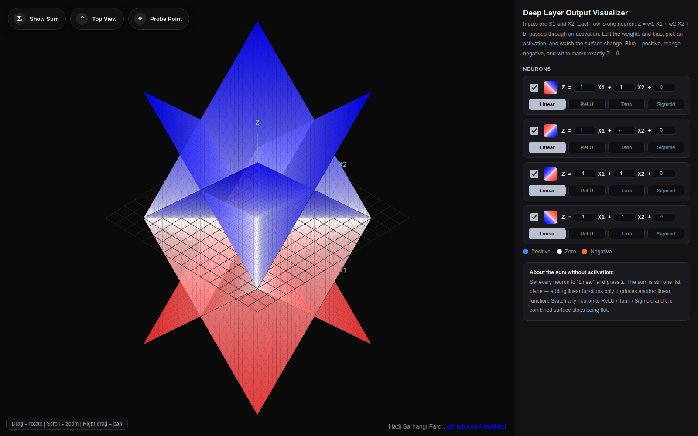

## Why this exists

Every explanation of a neural network eventually draws the same picture:
a neuron computes a **weighted sum** of its inputs, adds a bias, and
passes the result through an **activation function**. It's easy to write
that formula down. It's much harder to *see* what it actually does to the
input space — especially the part that matters most: why stacking plain
linear neurons can never do anything a single line can't, and why a tiny
dose of non-linearity changes everything.

This tool makes that visible. Four neurons, each taking two inputs
(`X1`, `X2`), are rendered as literal surfaces in 3D. Change a weight and
the surface tilts. Change the activation and it bends. Turn on all four
and sum them, and you can watch, in real time, four flat planes either
collapse into one more flat plane (if they're all linear) or fold
themselves into a genuinely curved surface (as soon as one of them isn't).

## Features

- **Four independent neurons**, each computing `Z = w1·X1 + w2·X2 + b`
- **Four activation functions per neuron** — Linear, ReLU, Tanh, Sigmoid —
  switchable with one click
- **Live editing** of every weight and bias, with the 3D surface and the
  side-panel color swatch updating instantly
- **Sum mode** — overlay the combined output of every active neuron as a
  fifth surface, together with a live equation panel that shows the
  algebraic sum (and collapses to a single flat-plane equation when every
  active neuron is linear)
- **Orthographic camera** — a single parallel-projection camera is used
  for every angle, including free rotation, so surfaces are never
  stretched or foreshortened no matter how you look at them
- **Top View** — snap straight down onto the `X1`–`X2` plane for a clean,
  undistorted read of where each surface crosses zero
- **Probe Point tool** — click anywhere on the base grid to drop a fixed
  vertical marker that reads off the exact value of every active neuron,
  and their sum, at that point
- Full orbit controls: drag to rotate, scroll to zoom, right-drag to pan

## How it works

Each of the four rows in the side panel is one neuron. It computes an
affine function of the two inputs:

```
Z = w1 · X1 + w2 · X2 + b
```

That function is sampled over a grid of `(X1, X2)` points spanning a fixed
square domain and rendered as a mesh, so the neuron becomes a literal
tilted plane in space. The plane is then passed through the neuron's
activation function — `Linear` leaves it untouched, `ReLU` clips
everything below zero flat, `Tanh` and `Sigmoid` squash it into an
S-shaped surface. Color follows the sign and magnitude of the output: the
surface fades from white at `Z = 0` toward **blue** as it rises above
zero and toward **orange** as it drops below, so the zero-crossing — the
neuron's decision boundary — is always the sharp white seam running
through the surface.

Pressing **Σ Show Sum** adds together the output of every active neuron
at every grid point and draws the result as its own surface. This is the
heart of the tool: if every active neuron is set to `Linear`, the sum is
provably still just one flat plane — adding linear functions only ever
produces another linear function, so the equation panel collapses the
whole sum into a single `aX1 + bX2 + c` line. The instant any neuron
switches to `ReLU`, `Tanh`, or `Sigmoid`, that's no longer true, and the
combined surface visibly folds or curves — a direct, hands-on
demonstration of why activation functions are what give neural networks
the ability to represent anything beyond a straight line.

| Sum of four linear neurons (still flat) | Sum including one ReLU neuron (folds) |
|---|---|
| 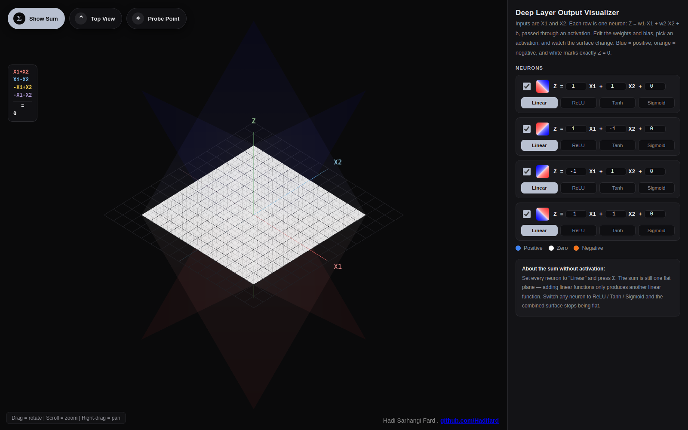 | 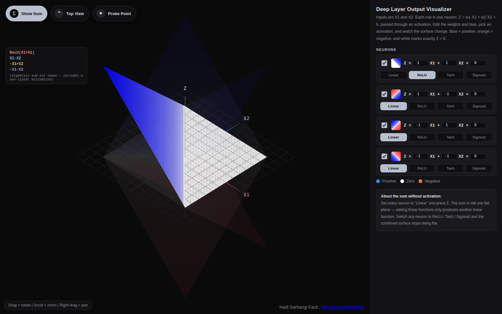 |

## Reading initialization before you train it

### Why explore this before training

In a real network, every weight and bias almost always starts out as a
random number — typically drawn from a distribution scaled by schemes
like Xavier/Glorot or He initialization — and training only nudges those
numbers around gradually, one small gradient step at a time, until the
decision boundary lines up with the data. That process works, but it has
a real cost: if the random starting point lands in an unlucky region of
weight space, the optimizer can spend a very long time crawling out of
it — and in some cases, it doesn't fully recover at all.

This tool sidesteps the randomness and lets you *see* the effect of one
specific weight, bias and activation combination immediately, with no
training loop involved. Drag a weight, flip an activation, and the
surface — and its decision boundary — updates on the spot. That's a
direct way to build intuition for the two things every initialization
scheme is quietly trying to get right at once: **where** the boundary
sits relative to the data (set by the *ratio* between the weights and the
bias), and **how much of the input domain is still "alive"** — still
capable of producing a useful gradient — at that scale (set by the
*magnitude* of the weights, together with the choice of activation).
Getting both roughly right from the start is what lets a network begin
converging almost immediately, instead of first having to migrate out of
a bad region of the loss landscape.

None of this replaces random initialization in a real network — a
production model has far too many weights to hand-tune, and some
randomness really is necessary so that neurons in the same layer don't
all start identical and learn the exact same thing. What exploring this
tool by hand gives you instead is the underlying feel for what schemes
like Xavier/Glorot and He initialization are specifically built to
protect: keeping the pre-activation values inside the responsive part of
the activation function, across as much of the input range as possible.

### Two ways a neuron can go quiet

Two closely related, very common failure modes are easy to trigger by
hand here, and both are worth seeing at least once.

**Saturation (vanishing gradient).** `Tanh` and `Sigmoid` are both
S-shaped: near zero they respond smoothly to changes in their input, but
away from zero they flatten out toward their limits (±1 for `Tanh`, 0/1
for `Sigmoid`) — and the flatter they are, the closer their local
gradient gets to zero. If the weights feeding a neuron are large relative
to the scale of its inputs, the pre-activation value
`w1·X1 + w2·X2 + b` blows past that responsive middle zone almost
everywhere in the domain, and the neuron ends up saturated for nearly
every point it sees. Its gradient during backpropagation shrinks to
something numerically negligible, so its weights barely move on each
update — learning there can crawl for a very long time before, if ever,
it escapes.

| Moderate weights (`w1=1, w2=1`) — smooth, mostly responsive | Large weights (`w1=14, w2=14`) — saturated almost everywhere |
|---|---|
| 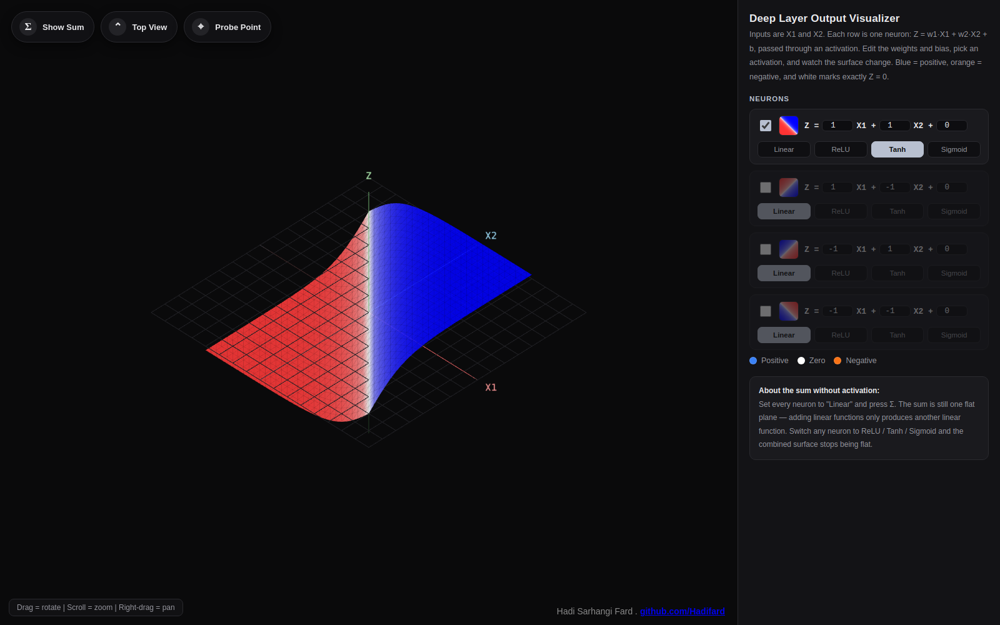 | 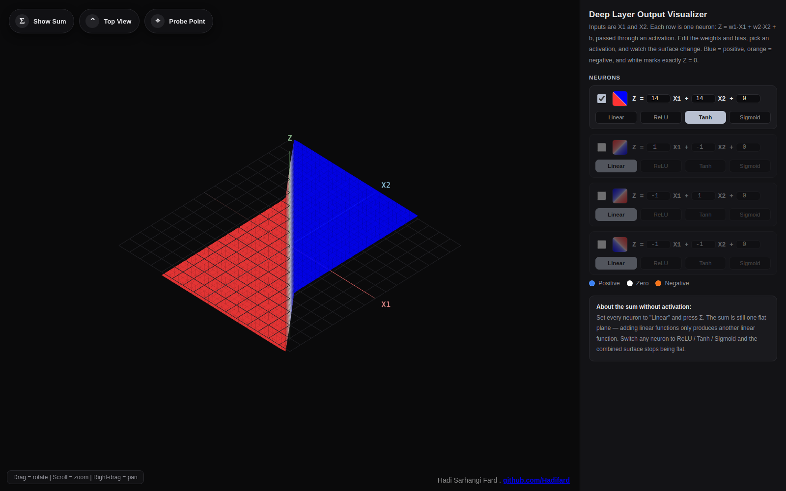 |

Notice how little changed about the underlying idea — same two inputs,
same activation, only the weights got bigger — and yet the second
surface is now flat, and therefore gradient-starved, across almost its
entire visible domain, with all of the useful, responsive behavior
squeezed into a razor-thin sliver right next to the boundary.

**Dead ReLU.** `ReLU` doesn't saturate the same way — it stays perfectly
linear for positive inputs — but it has its own failure mode: it outputs
exactly zero, with exactly zero gradient, for every negative input. If a
neuron's bias is unlucky enough (strongly negative relative to its
weights) that its pre-activation value stays negative across the entire
range of data it ever sees, its output — and its gradient — are zero
everywhere, always. Since backpropagation moves weights in proportion to
the gradient, a neuron in that state never receives a signal to move away
from it. It is, for practical purposes, permanently dead for the rest of
training.

| Healthy ReLU (`b=0`) | Dead ReLU (`b=-15`) |
|---|---|
| 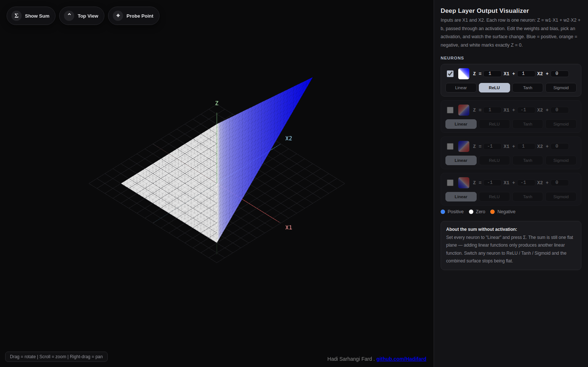 | 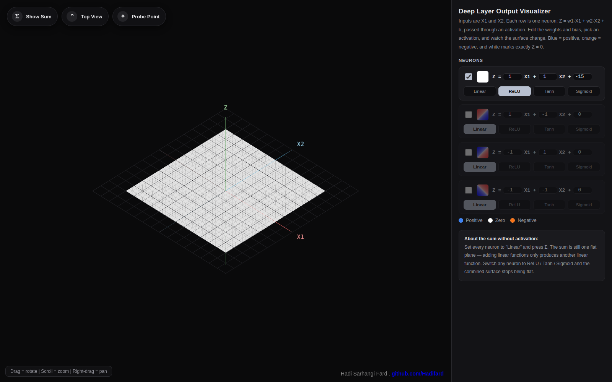 |

That second panel is what "the model went off track and can't come back"
looks like at the level of a single neuron: a flat, colorless plane,
contributing nothing to the output and receiving no gradient to fix
itself. Enough dead neurons in a layer, and the network permanently loses
that portion of its capacity for the rest of training — reviving it
means restarting from a fresh initialization, which is exactly the time
cost that exploring weight scale by hand, before training starts, is
meant to help you avoid.

### It's the ratio, not just the numbers

The two comparisons above change the *magnitude* of the weights, but the
*ratio* between `w1` and `w2` matters just as much, and controls
something different: it sets the *orientation* of the neuron's decision
line through the `X1`–`X2` plane, independent of how sharp or saturated
that boundary ends up being. Equal weights (`w1 = w2`) put the line
diagonally across the domain; making one weight much larger than the
other swings the line to run mostly parallel to one axis; flipping a
sign mirrors it onto the opposite diagonal. The bias, meanwhile, slides
that same line away from the origin without rotating it at all.

Put together: the *ratio* of `w1` to `w2` decides **where the boundary
points**, and the overall *magnitude*, relative to the bias, decides
**how sharp and how saturated** it is. Both are visible and instantly
adjustable here — which is the whole premise of this section of the
tool. Instead of waiting through many rounds of gradient descent to
discover that a boundary was oriented the wrong way, or that a whole
neuron had gone flat and stopped learning, you can see both problems
directly and correct for them before training ever starts.

## Case study: folding one layer into an XOR-like boundary

The same two levers — ratio and magnitude — that keep a single neuron
healthy scale up directly to a small layer of them. A single neuron can
only ever draw a straight line (a flat hyperplane, in
higher dimensions) through its input space. No matter how its weights and
bias are tuned, the boundary where it crosses zero stays straight — so a
lone neuron can separate two groups of points that sit cleanly on either
side of a line, but it can never separate groups that sit in *diagonally
opposite* corners of the input space. The textbook example of that is
**XOR**: one class occupies the bottom-left and top-right corners, the
other occupies the bottom-right and top-left, and no single straight line
can put all of one class on one side. This is a real, well-known limit of
a single linear classifier, and it's tempting to assume the fix requires
stacking several hidden layers.

It doesn't. A **single layer** containing a handful of non-linear
neurons, added together, is already enough — and it's easy to build and
watch that happen directly in this tool. The example below uses four
neurons from the side panel:

```
Neuron 1 (Linear):  Z = 1·X1   + 1·X2   + 0
Neuron 2 (Tanh):     Z = Tanh(-4.4·X1 - 4.5·X2)
Neuron 3 (Tanh):     Z = Tanh(-4.6·X1 + 1·X2)
Neuron 4 (Tanh):     Z = Tanh( 1.8·X1 - 5.1·X2 + 0.5)
```

Each `Tanh` neuron draws its own straight line through the plane
(wherever its own `w1·X1 + w2·X2 + b = 0`) and folds the surface along
it: far from that line the neuron flattens out toward +1 or −1, and only
close to the line does it curve smoothly between the two. Looked at on
its own, one `Tanh` neuron is just a single soft step. Press **Σ Show
Sum** and let the tool add three differently-angled steps together,
though, and their flat plateaus reinforce each other in some regions and
cancel out in others — producing a surface with several distinct peaks
and valleys instead of one simple tilt:

| Isometric view of the combined surface | Live sum formula panel |
|---|---|
| 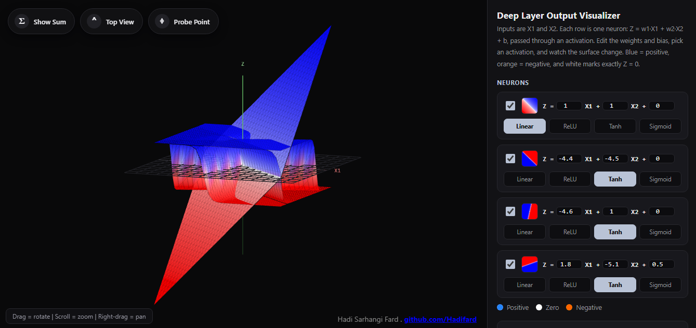 | 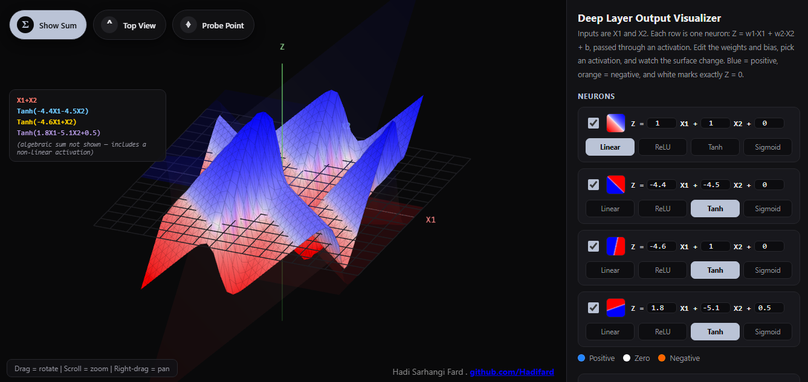 |

That's already a genuinely non-linear surface, and it came from a single
hidden layer — no second layer of neurons was added, only enough neurons
in the first one, combined together.

The clearest way to read the result is from directly above. Press **Top
View**, and the zero-crossing — the seam separating blue from orange —
traces out the exact *decision boundary* this little network would use
to classify the plane:

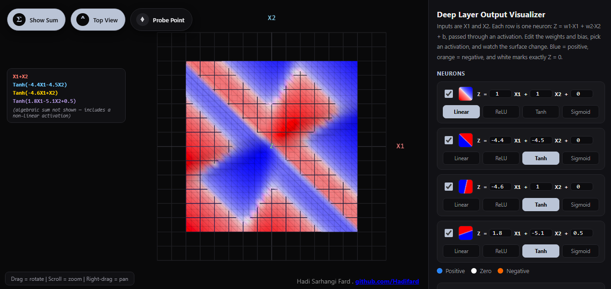

Notice the shape: it's no longer a single straight line. It bends into
an X, splitting the plane into four alternating regions — blue, orange,
blue, orange — arranged diagonally across from each other. That
diagonal, non-linearly-separable layout is exactly the shape of the XOR
problem, solved here with nothing more exotic than four neurons in one
layer and a plain sum.

It's worth trying by hand: set every neuron to `Linear`, press Show Sum,
then switch neurons in one at a time to `Tanh`, `ReLU`, or `Sigmoid` and
watch how each additional fold reshapes the boundary. That's really the
whole trick behind why solving a non-linear problem doesn't require
"deep" in the sense of many stacked layers. **Width** — enough neurons in
one layer — combined with **non-linearity** — any activation that isn't
flat — is what makes complex, non-convex boundaries possible in the
first place. Depth (stacking additional layers) is a separate tool for
representing even more intricate structure *efficiently*, not a
prerequisite for basic non-linear separability.

## Getting started

No installation, no package manager, no build step.

1. Clone or download this repository.
2. Open `index.html` in any modern desktop browser (Chrome, Edge, or
   Firefox recommended — the scene needs WebGL).

That's it — the page loads Three.js and `OrbitControls` from a CDN and
runs entirely client-side.

If your browser restricts local script loading when opening files
directly (some strict privacy setups do), serve the folder with any
static file server instead, for example:

```bash
python3 -m http.server 8000
# then open http://localhost:8000
```

### Deploying with GitHub Pages

Since this is a fully static site, GitHub Pages works out of the box:

1. Push this repository to GitHub.
2. Go to **Settings → Pages**.
3. Under **Build and deployment**, choose **Deploy from a branch**, pick
   your default branch and the `/ (root)` folder.
4. Save — your live demo will be at
   `https://<your-username>.github.io/<repository-name>/`.

## Controls

**Camera**
| Input | Action |
|---|---|
| Left-click + drag | Rotate the camera around the scene |
| Scroll wheel | Zoom in / out |
| Right-click + drag | Pan the camera |

**Per-neuron controls (side panel)**
| Control | Action |
|---|---|
| Checkbox | Turn that neuron on or off — affects its own surface, the halo view, the sum, and every active probe |
| `w1`, `w2`, `b` fields | Edit the neuron's weights and bias live |
| `Linear` / `ReLU` / `Tanh` / `Sigmoid` | Choose the neuron's activation function |

**Floating buttons (top-left, over the scene)**
| Button | Action |
|---|---|
| **Σ Show Sum** | Toggle the combined output surface and its live equation panel. Individual planes become translucent "halos" that brighten as you hover over them, so you can still see how each one contributes |
| **⌃ Top View** | Snap to a straight-down orthographic view of the `X1`–`X2` plane; click again to return to your previous camera angle |
| **⌖ Probe Point** | Toggle the probe tool. While active, click anywhere on the base grid to drop a fixed marker reading off every active neuron's value (and the sum) at that point. Right-click an existing probe to remove just that one. Turning the tool off clears every probe |

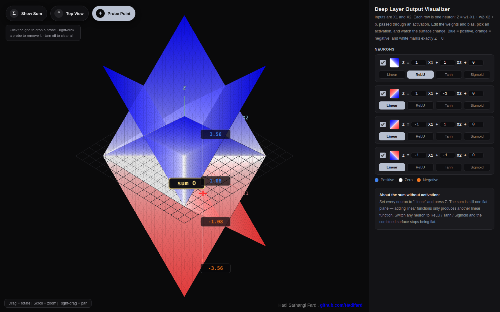

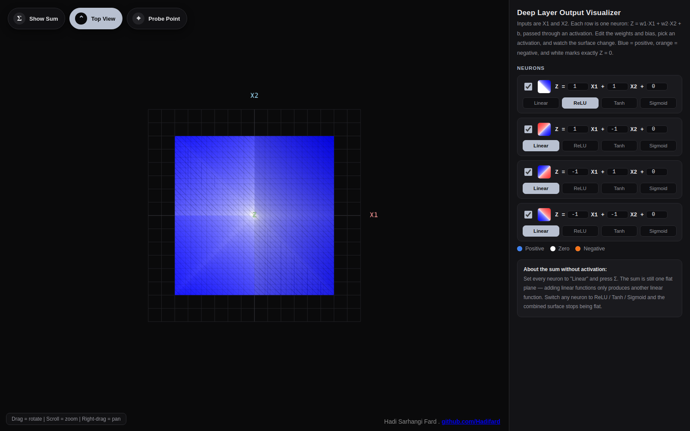

## Project structure

```
.
├── index.html                          # Page structure and layout only
├── css/
│   └── style.css                       # All styling for the panel, canvas overlays and controls
├── js/
│   ├── scene-setup.js                  # Camera, renderer, controls, lights, axes, base grid
│   ├── geometry.js                     # Activation functions, sampling grid, color mapping, mesh helpers
│   ├── planes.js                       # Neuron state, per-neuron and sum recomputation, halo hover effect
│   ├── ui-panel.js                     # Side panel (neuron rows) and the Show Sum / Top View buttons
│   ├── probes.js                       # The Probe Point tool: markers, labels, raycasting, click handling
│   └── main.js                         # Entry point: initial computation, resize handling, render loop
└── assets/
    └── screenshots/                    # Images used in this README
```

The JavaScript is deliberately split by responsibility rather than bundled
into one file, so each script has a single, clearly-named job and can be
read top to bottom on its own. Load order matters — `index.html` includes
the scripts in the sequence above, since each one builds on state set up
by the ones before it.

## Code walkthrough

This project intentionally has no build step, no framework and no
package manager: it's plain HTML, CSS and JavaScript, loaded directly by
the browser, split into small files purely for readability.

### Markup and styling

`index.html` contains structure only — the canvas container, the
floating buttons, and an empty side-panel shell. Every neuron row inside
the panel is generated by JavaScript at runtime (see **ui-panel.js**
below); nothing about the panel's content is hard-coded in the HTML.

`css/style.css` centers on a single `:root` block of CSS custom
properties (`--bg`, `--panel`, `--blue`, `--orange`, and so on), so the
entire color palette — background, panel, positive/negative surface
colors — lives in one place and can be re-themed by editing a handful of
variables instead of hunting through selectors. Layout is plain flexbox:
`#app` splits the window into the flexible canvas area and a fixed
420px side panel. Every floating overlay control — the FAB buttons, the
hint text, the sum formula, the probe hint — is absolutely positioned
*on top of* the canvas rather than laid out alongside it, so the WebGL
canvas can freely resize underneath them without disturbing the layout.

### JavaScript: six files, one dependency order

There's no module bundler here, so the six script files are loaded as
plain, classic `<script>` tags in a specific order, and they share the
browser's single global scope — each file simply continues where the
previous one left off, the same way the whole thing worked as one large
`<script>` block before it was split apart. The load order in
`index.html` **is** the dependency order:

1. **`scene-setup.js`** creates everything every other file needs: the
   `scene`, an `OrthographicCamera` (chosen specifically so no surface is
   ever foreshortened by perspective, no matter the viewing angle), the
   renderer, `OrbitControls`, lighting, the base grid, and the axis lines
   with their sprite-based text labels.
2. **`geometry.js`** holds only pure, reusable pieces: the four
   activation functions, the shared `(X1, X2)` sampling grid (computed
   once, so every neuron surface and the sum surface are always
   perfectly aligned to the same points), the height-to-color mapping,
   and the two functions — `buildEmptyMesh()` and `updateMeshHeights()`
   — that every surface in the scene is built and refreshed through.
3. **`planes.js`** is the model layer: the `planeDefs` array holds each
   neuron's live weights, bias, activation and mesh, plus the functions
   that keep the visuals in sync with that state — `recomputePlane()`
   for one neuron, `recomputeSum()` for the combined surface and its
   formula text, and `applyVisibility()` for switching between the
   normal and "halo" (sum-visible) look.
4. **`ui-panel.js`** is the only file that touches the DOM directly: it
   builds each neuron's row from a template string, and wires up its
   checkbox, inputs and activation buttons, plus the Show Sum / Top View
   buttons. Every event handler here does the same small thing — update
   one field on a `planeDefs` entry, then call straight back into the
   `recompute*` functions from **planes.js**. There's no separate
   state-management layer; the DOM elements and the `planeDefs` objects
   are kept in sync by direct function calls, not by a data-binding
   system.
5. **`probes.js`** is the most self-contained file: it uses a
   `THREE.Raycaster` to test the pointer against the base grid, and
   builds each probe as its own small group of primitives — a vertical
   line, marker spheres, and canvas-texture sprites for the floating
   numeric labels — so a probe can be created and disposed of as one
   unit.
6. **`main.js`** is deliberately the smallest file: it runs the first
   `recomputeAll()` so nothing is blank on load, wires up the resize
   handler, and starts the `requestAnimationFrame` loop. Everything it
   needs already exists by the time it runs, because of the load order
   above.

The pattern across all six files is the same one the original single-file
version used: a handful of plain objects hold the current state
(`planeDefs`, `sumVisible`, the `probes` array), and a small set of
`recompute*` / `apply*` functions read that state and rewrite the
Three.js geometry and the relevant bit of DOM text. There's no virtual
DOM, no reactive framework and no data-binding library involved — every
input event calls straight into the function that needs to run, which
keeps the whole thing small enough to read start to finish in one
sitting.

## Technology

- [Three.js](https://threejs.org/) r128 (WebGL rendering)
- [OrbitControls](https://threejs.org/docs/#examples/en/controls/OrbitControls) for camera interaction
- Vanilla HTML, CSS and JavaScript — no build tooling, no framework, no package manager required

## Browser support

Any modern desktop browser with WebGL support (Chrome, Edge, Firefox,
Safari). A mouse or trackpad is recommended for the drag/scroll/pan
camera controls.

## License

Released under the [MIT License](LICENSE) — see the `LICENSE` file for
the full text.

## Author

**Hadi Sarhangi Fard**
GitHub: [github.com/Hadifard](https://github.com/Hadifard)
